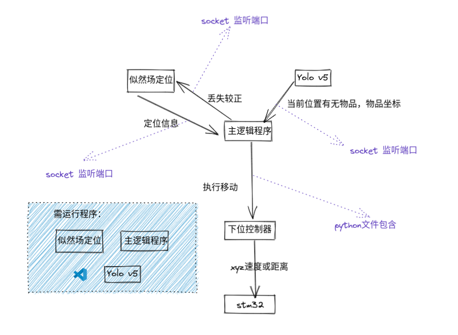
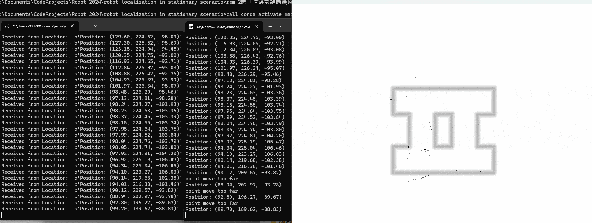

# 程序说明


## 文件架构

| 文件名        | 作用    |  是否需要修改  |
| --------   | ------   | ----  |
| CalcLidarData.py| 激光雷达数据处理 |  看激光雷达型号修改，此型号为LD06，有两个激光雷达型号   |
| LikelihoodField.py     | 基于似然场的机器人定位算法 |   基本不需要    |
| Socket_fun.py     | Socket通信程序的封装 |   基本不需要    |
| Location.py        |  机器人定位实现主程序  |  基本不需要   |
| Location_simulation.py        |  机器人定位_基于数据包调试  |  基本不需要   |
| config.yaml       |  机器人定位配置参数  |  需要   |
| contorller.py        |  机器人与stm32通信程序  |  需要   |
| Main.py        |  机器人逻辑主程序  |  需要   |
| run.bat        |  一键启动多个python程序  |  需要   |


---

## 任务清单

- [x] 机器人定位
- [x] 程序大框架
- [ ] yolo
  - [ ] 获取目标物品位置
  - [ ] 与主程序socket通信
  - [ ] 商品名单识别
- [ ] 控制器通信
  - [ ] 机器人移动控制
  - [ ] 机器人抓取控制
- [ ] 主程序
  - [ ] 逻辑控制
- [ ] stm32
  - [ ] 串口通信
  - [ ] 步进电机控制
  - [ ] 机械臂控制
  - [ ] 升降控制


---

## 文件具体说明

### LIDAR_LD06_python_loder/CalcLidarData.py
激光雷达数据处理
这个需要根据激光雷达型号修改，此型号为LD06

一般需要写成一类，传入一个串口对象。

编写一个读取函数，读取函数传入一个由Manager管理的多进程下可用的字典。
把字典中写上'ranges'，'angles'，'is_new'
分别为激光雷达的距离列表，角度列表，是否是新数据列表。注意距离列表和角度列表要一一对应。


### LikelihoodField.py
基于似然场的机器人定位算法

底层原理：https://www.cnblogs.com/darkarc/p/18081246

此文件基本不用修改，唯一需要修改的是对于大幅度变化，或小车自旋时，可以考虑给似然场的机器人初始位资做预测估计。

对于机器人地图漂移后，可以考虑让stm32停止所有动作，然后让似然场定位算法撒一些初始位姿点，判断似然场定位算法是否收敛，收敛则重新开始运行。

### Location.py
机器人定位实现主程序

里面前半部分是在进行socket通信，后半部分是机器人定位算法，这个基本不用修改。

### Location_simulation.py
机器人定位_基于数据包调试

这个文件是用来调试的，不是采用串口接受数据，而是对于保存下来的串口数据log，对log进行回放，方便记录问题的调试，需要到config文件中修改log文件路径。

### config.yaml
机器人定位配置参数

这里的具体参数含义我放在了它文件里面，自行查看即可。

### contorller.py
机器人与stm32通信程序

这里需要编写一些电脑与stm32的通信解析协议，比如
| 指令        | 作用    | 
| --------   | ------   |
|X 11 Y 12 Z 13| 指机器人x方向速度，y方向速度，和z轴旋转速度 |  
| ARM GET  | 机器人机械臂前伸抓取物品 | 
| ARM 30 15 20 40 50        |  机械臂上每个舵机的角度   |
| .......        |  .......  |  基本不需要   |

这些指令通过uart串口发送给stm32,让stm32控制机器人。

### Main.py
机器人逻辑主程序

这里前半部分都是建立socket连接，后半部分是机器人逻辑控制，需要根据任务清单修改。

---
## 安装教程
```
pip install numpy opencv-python pyserial PyYAML
```

注意python版本越高越好，因为官方说新版本都在优化python运行速度。

可以尝试使用pyinstall导出成exe，看是否能提升速度。

---
## 效果展示
